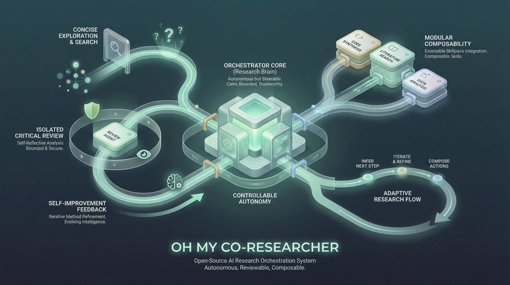
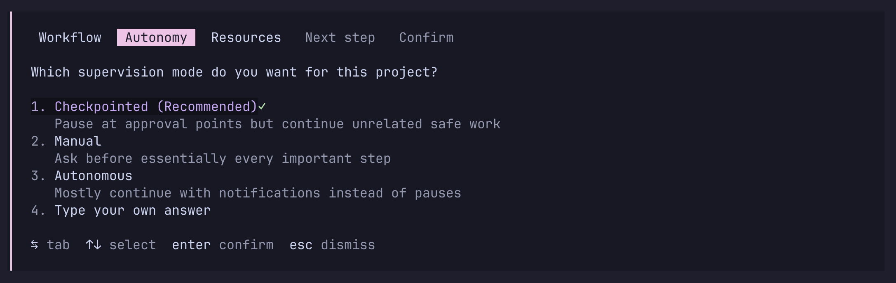

<!-- # Oh My Co-Researcher -->


[中文](README_CN.md) | [English](README.md)

**Oh My Co-Researcher** 是一个可扩展、自我进化的 Agent 技能包，专为自主 ML 研究设计。就像 oh-my-zsh 之于 shell——从精简核心出发，让 agent 帮你配置和扩展技能栈。

一个完全属于你的 co-researcher：



> - **自主但可控。** 自定义监督策略：何时询问、通知或直接执行。检查点、资源规则、想法变化规则——均可配置。
> - **会推断的 agent。** `research` 发现缺口、调整 todo 列表，确认后再行动——不是固定流水线。
> - **对抗性评审。** Critic 在隔离上下文中运行，返回 FATAL/MAJOR/MINOR 问题 + PROCEED/REFINE/PIVOT 结论。
> - **BFS 模式。** 可选的自主设计空间搜索，风格参考 *autoresearch*。
> - **自我进化。** `evolve` 从会话经验中提出技能补丁，或引入外部技能包并做兼容性检查。由你决定是否合并。
> - **兼容且可组合。** 适配任何 LLM agent 框架。从任意来源引入外部技能。定制你的技能栈。

---

## 快速开始

将以下内容粘贴给你的 agent（Claude Code、Open Code、Codex 等）——它会自动获取安装指南并完成配置：

```
Install and configure "Oh_My_Co-Researcher" skill pack following the instructions in https://raw.githubusercontent.com/zy-ning/Oh_My_Co-Researcher/refs/heads/main/README.md and https://raw.githubusercontent.com/zy-ning/Oh_My_Co-Researcher/refs/heads/main/docs/agent-setup.md.
```

然后在你的项目目录中运行 `/research`。如果 `RESEARCH.md` 不存在，技能会自动引导你填写目标。

> **离线或手动安装**，请参见文末的[安装说明](#安装)。

---

## 核心技能

| 技能 | 用途 |
|------|------|
| `research` | 主 agent。读取 `RESEARCH.md`，推断缺口，调整 TODO，委派给合适的技能。遵循你的监督策略。 |
| `experiment` | 运行 ML 实验：隔离虚拟环境、时间预算、异常处理。支持 BFS 模式。 |
| `review` | 对抗性评审，分 FATAL/MAJOR/MINOR 三级。依次回退：Codex → llm → minimax。 |
| `write` | 以 `RESEARCH.md` 结果为基础撰写论文。内联标注 `[UNGROUNDED]` 和 `[UNVERIFIED]`。 |
| `customize` | 项目入门与个性化。基于精选注册表推荐预设/技能包，写入 `.co-researcher/skills.yaml`。 |
| `supervision` | 通过先选预设再微调的方式，配置 `RESEARCH.md` 中的 `## Supervision Policy`。 |
| `evolve` | 会话结束时提取经验**并**个性化技能包。提出差异补丁——仅由人类合并。 |

---

## Agent 循环原理

`research` 读取项目状态，自主决定下一步：

1. **评估** — 对比 Goal 与 Context，找出缺口（如"实验完成但无论文 TODO"）
2. **提案** — 调整 TODO 列表并等待确认后再行动
3. **执行** — 选取优先级最高的 TODO，委派给生态中合适的技能
4. **循环** — 呈现结果并询问"是否继续？"或提供选项

每次新会话或上下文压缩后，agent 先读取 `RESEARCH.md` 中的 `## Pipeline Status`，约 30 秒内恢复工作状态。

---

## 定制技能包

本仓库采用 **精简核心 + 精选注册表** 模型。agent 帮你管理技能栈——你只需选择一个配置画像。

运行 `/customize` 进行项目入门或更改技能配置：

1. 选择工作流画像：`core-only`、`literature-heavy`、`experiment-heavy`、`academic-rigor`、`balanced` 或自定义
2. 选择依赖容忍度
3. 选择自动化风格与资源策略
4. 确认预设或自定义技能组合
5. Agent 写入 `.co-researcher/skills.yaml`

注册表位于 `skillpacks/skill_dictionary.yaml`，精选预设位于 `skillpacks/presets/*.yaml`，项目级选择写入 `.co-researcher/skills.yaml`。

完整说明见 [`docs/skillpack-customization.md`](docs/skillpack-customization.md)。

### 更多技能包

可通过 `evolve`（personalize 模式）按需从以下项目引入技能：

| 技能包 | 可提供内容 |
|--------|------------|
| [ARIS](https://github.com/wanshuiyin/Auto-claude-code-research-in-search) | 最适合按需引入的研究基础技能：文献调研、方法精炼、实验规划、结论校验 |
| [Feynman](https://github.com/getcompanion-ai/feynman) | AlphaXiv 论文问答、审计与带引用研究简报 |
| [NanoResearch](https://github.com/OpenRaiser/NanoResearch) | 可替代的端到端研究主干，强调 9 阶段流程、SLURM/GPU 编排和通知 |
| [AutoResearchClaw](https://github.com/aiming-lab/AutoResearchClaw) | 更重型的自治研究系统，强调多阶段规划和自愈循环 |
| [AI-Research-SKILLs](https://github.com/Orchestra-Research/AI-Research-SKILLs) | 面向具体 ML 任务、基础设施和评测流程的大型能力库 |
| [academic-research-skills](https://github.com/Imbad0202/academic-research-skills) | 偏学术写作、评审和论文生产流程的专业技能包 |

---

## 监督策略控制



使用 `/supervision` 配置当前项目中 agent 的自动化程度。

交互流程遵循"先预设，后覆盖"：

1. 选择预设：`manual`、`checkpointed`、`autonomous`、`wild`
2. 按需调整通知事件
3. 按需调整审批门槛
4. 选择停止目标 / 限制条件
5. 配置资源规则
6. 配置想法变化规则
7. 如需持久化，将策略写入 `RESEARCH.md`

策略保存在 `RESEARCH.md` 的 `## Supervision Policy` 段落中，保持可读、可手工编辑，并能参与会话恢复。

关键能力：
- `checkpointed` 模式下支持"排队审批"，让 agent 在等待审批时继续处理其他已允许的工作
- 按 **Service / API**、**Compute**、**Human / Physical** 三类管理资源边界
- 分别控制想法改进、策略转向、方案妥协时是通知用户还是请求审批
- `wild` 模式：在达到完成条件或硬边界前持续工作

完整说明见 [`docs/supervision-system.md`](docs/supervision-system.md)。

---

## BFS 模式（手动开启）

灵感来自 [karpathy/autoresearch](https://github.com/karpathy/autoresearch)。告诉 agent"探索设计空间"或"autoresearch"，它会确认：

- **目标文件** — 唯一允许修改的文件（如 `train.py`）
- **指标** — 可验证的标量目标（如最小化 `val_bpb`）
- **预算** — 每次运行时间（默认 5 分钟）与最大实验次数

随后 `experiment` 自主运行：设计假设 → 提交 → 运行 → 提取指标 → 保留或 `git reset` → 重复。每次运行记录至 `results.tsv`，汇总表格完成后写入 `RESEARCH.md` Context。

默认关闭——仅在明确要求时激活。即使在 `wild` 模式下，BFS 仍遵守显式资源规则、安全边界与完成条件。

---

## 进化技能包

`evolve` 提供三种模式：

**会话模式** — 在会话结束时运行。从 `RESEARCH.md` History 和 git log 中提取可复用经验，提出对相关 `SKILL.md` 文件的修改建议。

**个性化模式** — 指向任意外部技能或技能包。它会读取目标、盘点已安装技能、检查兼容性与范围重叠，集中提问（一次性问完），然后提出仅包含你确认内容的精选补丁。

**注册表模式** — 刷新 `skillpacks/skill_dictionary.yaml` 与预设建议。

```bash
/evolve                                     # 会话模式
/evolve -- personalize feynman audit skill  # 集成单个外部技能
/evolve -- personalize ~/.claude/skills/    # 审计整个已安装技能包
```

补丁输出至 `lessons/`，满意后应用：

```bash
git apply lessons/YYYYMMDD-personalize-slug.diff
```

技能不会被自动修改，仅由人类合并。

### 进化循环

**研究循环**：`research` 选取 TODO → 委派 → 更新 `RESEARCH.md` → 提出下一步 → 循环。

**技能进化循环**：`evolve`（会话） → `lessons/` → 人工审查 → `git apply` → 下次会话技能更强。

**个性化循环**：发现有用的外部技能 → `evolve`（个性化） → 精选补丁 → 合并 → 技能包持续成长。

**注册表循环**：评估新技能包 → `evolve`（注册表） → 更新 `skillpacks/skill_dictionary.yaml` → 下次 `customize` 给出更合适的推荐。

---

## 安装

> 大多数用户可以跳过此节——上方的快速开始提示词会自动处理安装。

### 核心技能包

```bash
# 项目级安装（安装到当前目录）
curl -fsSL https://raw.githubusercontent.com/zy-ning/Oh_My_Co-Researcher/main/install.sh | bash

# 全局安装（任意项目可用）
curl -fsSL https://raw.githubusercontent.com/zy-ning/Oh_My_Co-Researcher/main/install.sh | bash -s -- --global
```

安装内容：skills → `.claude/skills/`，templates → `templates/`，skillpacks → `skillpacks/`，`CLAUDE.md` → 项目根目录（全局安装时写入 `~/.claude/co-researcher/`）。

仅安装 skills 的替代方式：

```bash
npx skills add zy-ning/Oh_My_Co-Researcher
```

### ARIS 精简技能集（推荐）

```bash
git clone https://github.com/wanshuiyin/Auto-claude-code-research-in-sleep.git /tmp/aris
mkdir -p ~/.claude/skills
cp -r /tmp/aris/skills/research-lit ~/.claude/skills/
cp -r /tmp/aris/skills/research-refine ~/.claude/skills/
cp -r /tmp/aris/skills/experiment-plan ~/.claude/skills/
cp -r /tmp/aris/skills/result-to-claim ~/.claude/skills/
# 可选扩展：
# cp -r /tmp/aris/skills/arxiv ~/.claude/skills/
# cp -r /tmp/aris/skills/paper-figure ~/.claude/skills/
rm -rf /tmp/aris
```

最推荐的 ARIS 技能：
- `research-lit` — 文献调研
- `research-refine` — 方法与想法精炼
- `experiment-plan` — 实验蓝图
- `result-to-claim` — 验证结果真正支持的结论

默认不建议加载：`run-experiment`、`paper-write`、`auto-review-loop`。本仓库已内置 `experiment`、`write`、`review`。

### Codex MCP（可选，推荐作为 `review` 的外部隔离审稿者）

```bash
npm install -g @openai/codex
codex setup                               # 提示时选择 gpt-5.4 模型
claude mcp add codex -s user -- codex mcp-server
```

`review` 的核心要求是隔离上下文。本地隔离子 agent 也可以；额外备选：`auto-review-loop-llm`（设置 `LLM_API_BASE` + `LLM_API_KEY`）或 `auto-review-loop-minimax`（设置 `MINIMAX_API_KEY`）。

### Feynman 技能包（可选）

```bash
curl -fsSL https://feynman.is/install-skills | bash
feynman alpha login   # 完成 AlphaXiv 一次性认证
```

提供：`alpha-research`（论文问答）、`audit`（论文与代码库可复现性对比）。

### LaTeX（可选，生成 PDF 输出时必需）

```bash
brew install --cask mactex && brew install poppler        # macOS
sudo apt install texlive-full latexmk poppler-utils       # Ubuntu
```
